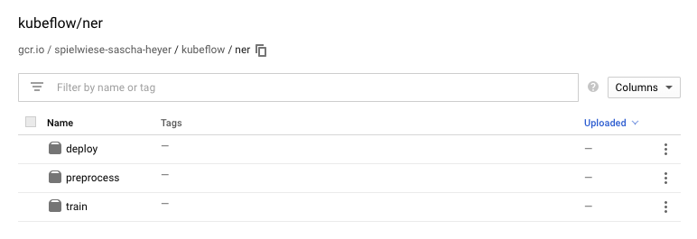

# Build components

A component is code that performs one step in the Kubeflow pipeline. It is a containerized implementation of an ML task. **Components can be reused in other pipelines.**

## Component structure
A component follows a specific [structure](https://www.kubeflow.org/docs/pipelines/sdk/component-development/) and contains:
 
* `/src` - Component logic . 
* `component.yaml` - Component specification. 
* `Dockerfile` - Dockerfile to build the container. 
* `readme.md` - Readme to explain the component and its inputs and outputs. 
* `build_image.sh` - Scripts to build the component and push it to a Docker repository. 

## Components
This Kubeflow project contains 3 components:

### Preprocess component
The preprocess component is downloading the training data and performs several preprocessing steps. This preprocessing step is required in order to have data which can be used by our model. 


### Train component
The train component is using the preprocessed training data. Contains the model itself and manages the training process. 

### Deploy component
The deploy component is using the model and starts a deployment to AI Platform. 

## Build and push component images
In order to use the components later on in our pipelines,you have to build and then push the image to a Docker registry. In this example, you are using the 
[Google Container Registry](https://cloud.google.com/container-registry/), it is possible to use any other docker registry. 

Each component has its dedicated build script `build_image.sh`, the build scripts are located in each component folder:

* `/components/preprocess/build_image.sh`
* `/components/train/build_image.sh`
* `/components/deploy/build_image.sh`

To build and push the Docker images open a Terminal, navigate to `/components/` and run the following command:

```bash
$ ./build_components.sh
```

## Check that the images are successfully pushed to the Google Cloud Repository

Navigate to the Google Cloud Container Registry and validate that you see the components. 



## Upload the component specification
The specification contains anything you need to use the component. Therefore you need access to these files later on in your pipeline. 
It also contains the path to our docker images, open `component.yaml` for each component and set **`<PROJECT-ID>`** to your Google Cloud Platform project id.

Upload all three component specifications to your Google Cloud Storage and make it public accessible by setting the permission to `allUsers`.

> It is also possible to upload those files to a storage solution of your choice.

Navigate to the components folder `/components/` open `copy_specification.sh` set your bucket name `BUCKET="your-bucket"` and run the following command:

```bash
$ ./copy_specification.sh
```

The bucket contains 3 folder:


## Troubleshooting
Run `gcloud auth configure-docker` to configure docker, in case you get the following error message:

```b
You don't have the needed permissions to perform this operation, and you may have invalid credentials. To authenticate your request, follow the steps in: https://cloud.google.com/container-registry/docs/advanced-authentication
```

*Next*: [Upload the dataset](step-3-upload-dataset.md)

*Previous*: [Setup Kubeflow and clone repository](step-1-setup.md)